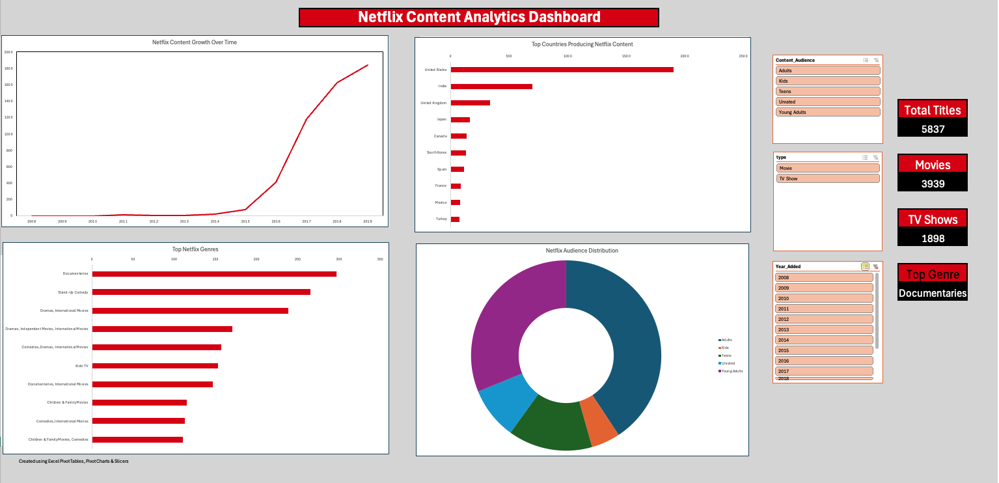
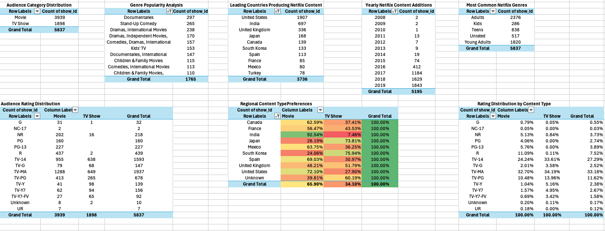

## Netflix Content Analytics Dashboard

Interactive Excel dashboard analyzing Netflix content trends, audience segmentation, genre distribution, and global production patterns using Pivot Tables, Pivot Charts, slicers, and KPI reporting.

### Dashboard Preview

### Features
- Pivot Table analytics
- Interactive slicers
- KPI reporting
- Genre analysis
- Geographic analysis
- Audience segmentation
- Content growth trend analysis

### Supporting pivot table
The workbook also includes advanced supporting analyses using Pivot Tables, percentage distributions, conditional formatting, and segmentation analysis.

### Tools Used
- Microsoft Excel
- Pivot Tables
- Pivot Charts
- Slicers
- Dashboard Design

### Key Insights
- Netflix experienced rapid content expansion after 2015
- Adult and young-adult content dominate the platform
- The United States and India produce the highest volume of content
- Documentaries are among the most common genres
